# 🚀 PLANO DE NEGÓCIO UZZBUILDER - R01

> [!SUMMARY] **VERSÃO R01 - DOCUMENTO ESTRATÉGICO COMPLETO**
>
> Este documento consolida **TODA** a estratégia de negócio do UzzBuilder (Template Skeleton) em diagramas visuais detalhados.
>
> **O que é o UzzBuilder:**
> - Sistema de construção rápida de sites institucionais
> - Template skeleton universal e parametrizável
> - Processo padronizado: cliente → site em 4-6 horas
> - Reduz tempo de desenvolvimento de 8-10h para 4-6h por projeto
> - Permite escalar de 2 para 5+ clientes por mês
>
> **Baseado em:** Arquitetura completa, Guia de Uso, Filosofia do Skeleton, Documentação técnica.

---

## 📑 ÍNDICE COMPLETO (25 Seções)

### **PARTE I: VISÃO EXECUTIVA**
1. [Status Executivo Atual](#1-status-executivo-atual)
2. [Posicionamento Estratégico](#2-posicionamento-estratégico)
3. [Diferenciais Competitivos Únicos](#3-diferenciais-competitivos-únicos)

### **PARTE II: ROADMAP E TIMELINE**
4. [Roadmap Estratégico](#4-roadmap-estratégico)
5. [Timeline de Operação](#5-timeline-de-operação)
6. [Distribuição de Tarefas](#6-distribuição-de-tarefas)

### **PARTE III: MODELO DE NEGÓCIO**
7. [Modelo de Receita e Pricing](#7-modelo-de-receita-e-pricing)
8. [Projeção Financeira Realista](#8-projeção-financeira-realista)
9. [Análise de Custos Operacionais](#9-análise-de-custos-operacionais)

### **PARTE IV: ESTRATÉGIA COMERCIAL**
10. [Funil de Vendas Completo](#10-funil-de-vendas-completo)
11. [⭐ Processo de Vendas Guiado](#11-processo-de-vendas-guiado)
12. [Framework de Qualificação](#12-framework-de-qualificação)
13. [Tratamento de Objeções](#13-tratamento-de-objeções)

### **PARTE V: MARKETING E AQUISIÇÃO**
14. [Estratégia de Marketing](#14-estratégia-de-marketing)
15. [Canais de Aquisição](#15-canais-de-aquisição)
16. [Customer Journey Completo](#16-customer-journey-completo)

### **PARTE VI: ANÁLISE COMPETITIVA**
17. [Análise de Concorrentes](#17-análise-de-concorrentes)
18. [Sweet Spot de Mercado](#18-sweet-spot-de-mercado)
19. [Battle Cards por Concorrente](#19-battle-cards-por-concorrente)

### **PARTE VII: OPERAÇÕES E PROCESSOS**
20. [Processo Operacional Padronizado](#20-processo-operacional-padronizado)
21. [Checklist de Qualidade](#21-checklist-de-qualidade)

### **PARTE VIII: RISCOS E MITIGAÇÃO**
22. [Matriz de Riscos](#22-matriz-de-riscos)
23. [Plano de Contingência](#23-plano-de-contingência)

### **PARTE IX: MÉTRICAS E EXPANSÃO**
24. [KPIs e Métricas de Sucesso](#24-kpis-e-métricas-de-sucesso)
25. [Roadmap de Expansão 2025-2026](#25-roadmap-de-expansão-2025-2026)

---

# PARTE I: VISÃO EXECUTIVA

---

## 1. Status Executivo Atual

### Dashboard de Status

```mermaid
graph TB
    subgraph "📊 STATUS GERAL DO PROJETO"
        S1["Progresso: 100% - Template Completo ✅"]
        S2["Fase: OPERACIONAL - Pronto para Uso"]
        S3["Status: PRODUÇÃO"]
        S4["Primeiros Clientes: A definir"]
    end
    
    subgraph "✅ COMPONENTES COMPLETOS"
        F1["Componentes Primitivos ✅ 100%"]
        F2["Componentes Especializados ✅ 100%"]
        F3["Seções de Página ✅ 100%"]
        F4["Documentação Completa ✅ 100%"]
    end
    
    subgraph "🔄 PROCESSOS ESTABELECIDOS"
        F5["Guia de Uso Completo ✅"]
        F6["Checklist Cliente ✅"]
        F7["Arquitetura Documentada ✅"]
        F8["Fluxo 4-6h Validado ✅"]
    end
    
    subgraph "📈 MÉTRICAS VALIDADAS"
        M1["Tempo: 4-6h vs 8-10h (redução 40%)"]
        M2["Capacidade: 5+ clientes/mês vs 2"]
        M3["Qualidade: 100% checklist compliance"]
    end
    
    S1 --> F1
    S2 --> F5
    S3 --> M1
    
    style S1 fill:#90EE90
    style F1 fill:#90EE90
    style M1 fill:#FFD700
```

### Métricas Atuais

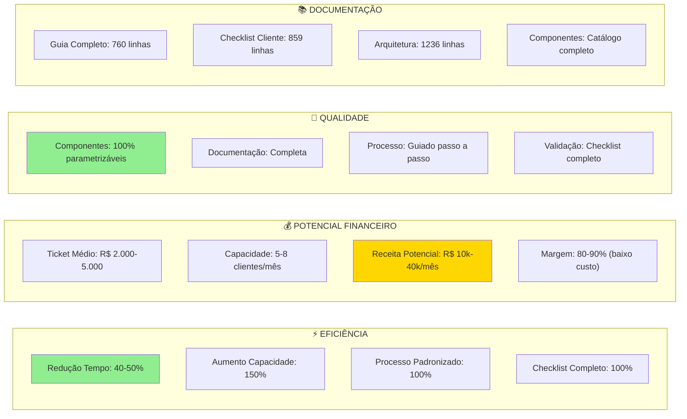

---

## 2. Posicionamento Estratégico

### Visão do Produto

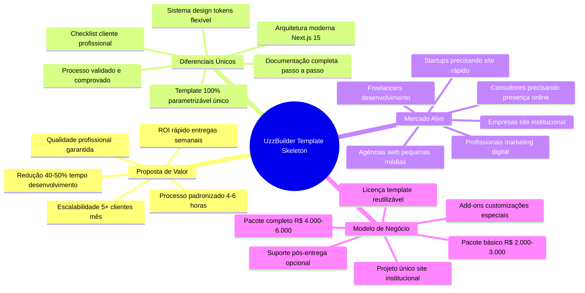

### Público-Alvo Detalhado

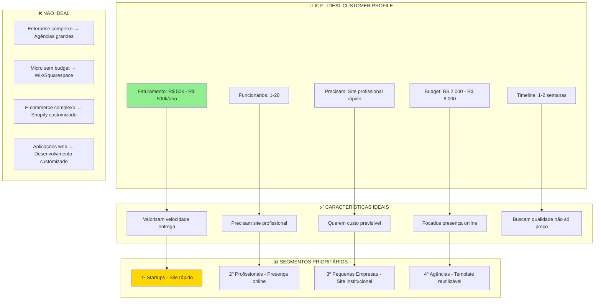

---

## 3. Diferenciais Competitivos Únicos

### Matriz de Diferenciais vs. Mercado

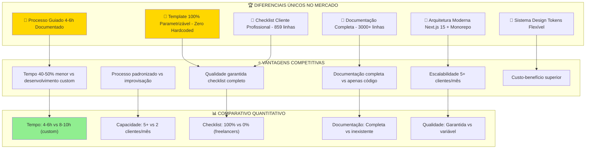

### Posicionamento no Mercado

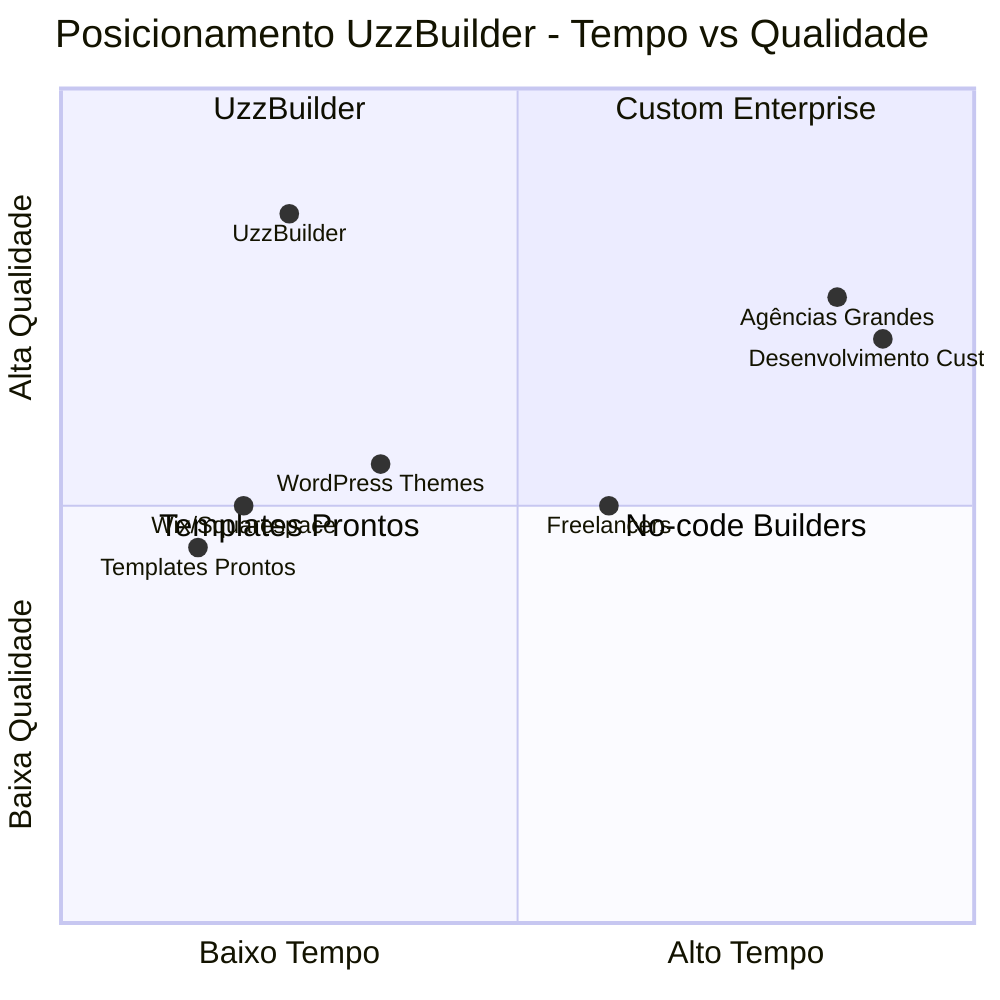

---

# PARTE II: ROADMAP E TIMELINE

---

## 4. Roadmap Estratégico

### Roadmap Multi-Dimensional

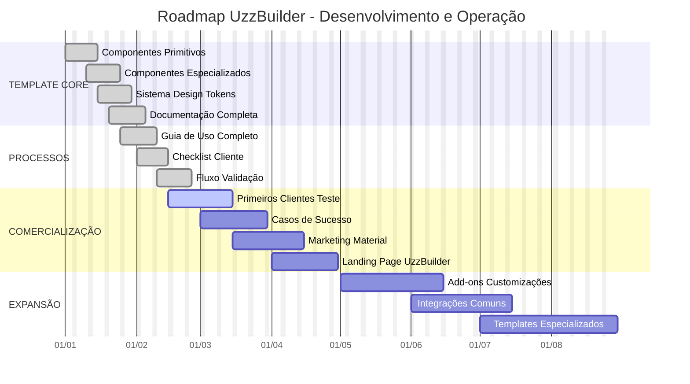

### Marcos Críticos

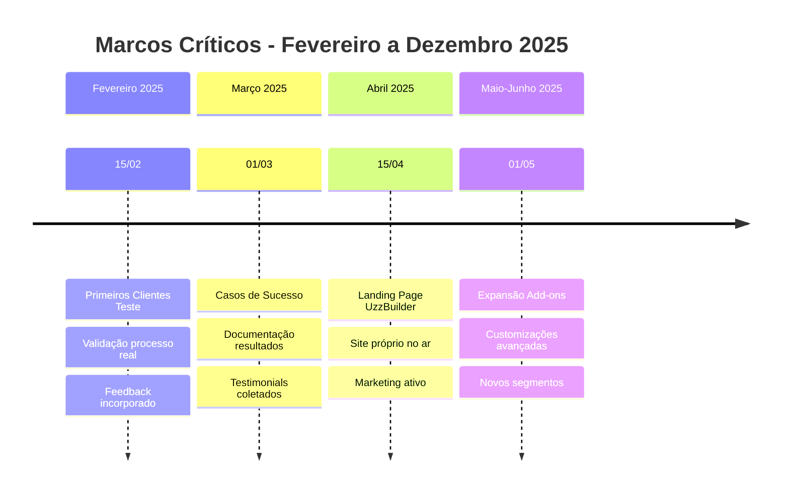

---

## 5. Timeline de Operação

### Processo por Cliente (4-6 horas)

```mermaid
gantt
    title Timeline Completa - Projeto Cliente (4-6 horas)
    dateFormat HH:mm
    axisFormat %H:%M

    section FASE 1: COLETA
    Reunião com Cliente          :a1, 00:00, 1h
    Organizar Materiais           :a2, after a1, 30m

    section FASE 2: CONFIGURAÇÃO
    Copiar Skeleton              :b1, after a2, 10m
    Preencher site.config.ts     :b2, after b1, 20m
    Configurar .env.local        :b3, after b2, 10m

    section FASE 3: CUSTOMIZAÇÃO
    Cores Design Tokens          :c1, after b3, 20m
    Logo e Favicons              :c2, after c1, 15m
    Assets e Imagens             :c3, after c2, 30m
    Montar Páginas               :c4, after c3, 1h30m

    section FASE 4: VALIDAÇÃO
    Testes Locais                :d1, after c4, 30m
    Lighthouse Audit             :d2, after d1, 15m
    Correções                    :d3, after d2, 15m

    section FASE 5: DEPLOY
    Build Produção               :e1, after d3, 10m
    Deploy Vercel                :e2, after e1, 10m
    Configurar Domínio           :e3, after e2, 10m

    section FASE 6: ENTREGA
    Documentação Handoff         :f1, after e3, 20m
    Treinar Cliente              :f2, after f1, 10m
```

---

## 6. Distribuição de Tarefas

### RACI Matrix Visual

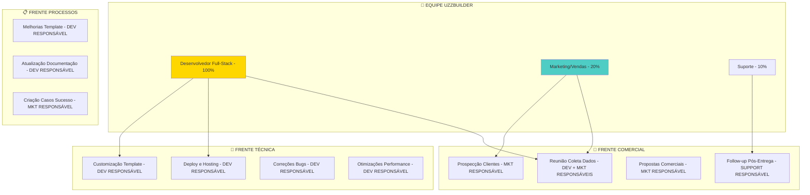

---

# PARTE III: MODELO DE NEGÓCIO

---

## 7. Modelo de Receita e Pricing

### Estrutura de Pacotes

```mermaid
graph TB
    subgraph "💰 MODELO DE RECEITA"
        Plans["3 Pacotes Principais"]
        Addons["Add-ons Opcionais"]
        Support["Suporte Pós-Entrega"]
        License["Licença Template"]
    end

    subgraph "🌱 PACOTE BÁSICO - R$ 2.000"
        S1["Site institucional completo"]
        S2["Até 5 páginas"]
        S3["Design responsivo"]
        S4["Formulário de contato"]
        S5["SEO básico configurado"]
        S6["Deploy incluído"]
        S7["1 revisão incluída"]
    end

    subgraph "🚀 PACOTE COMPLETO - R$ 4.000 - MAIS POPULAR"
        P1["Site institucional completo"]
        P2["Até 10 páginas"]
        P3["Design customizado"]
        P4["Blog integrado"]
        P5["SEO avançado"]
        P6["Google Analytics"]
        P7["Integrações (email, WhatsApp)"]
        P8["3 revisões incluídas"]
        P9["Suporte 30 dias"]
    end

    subgraph "🏢 PACOTE ENTERPRISE - R$ 6.000"
        E1["Site institucional completo"]
        E2["Páginas ilimitadas"]
        E3["Design totalmente customizado"]
        E4["Blog + CMS"]
        E5["E-commerce básico opcional"]
        E6["Integrações avançadas"]
        E7["Multilíngue"]
        E8["Revisões ilimitadas"]
        E9["Suporte 90 dias"]
        E10["Treinamento completo"]
    end

    subgraph "➕ RECEITA ADICIONAL"
        A1["Páginas extras: R$ 300/página"]
        A2["Customizações especiais: R$ 500-2.000"]
        A3["Manutenção mensal: R$ 300-500/mês"]
        A4["Suporte prioritário: R$ 200/mês"]
        A5["Hospedagem gerenciada: R$ 100/mês"]
    end

    Plans --> S1
    Plans --> P1
    Plans --> E1

    Addons --> A1
    Addons --> A2
    Support --> A3
    Support --> A4
    License --> A5

    style P1 fill:#FFD700
    style Plans fill:#4ECDC4
```

### Comparativo de Valor

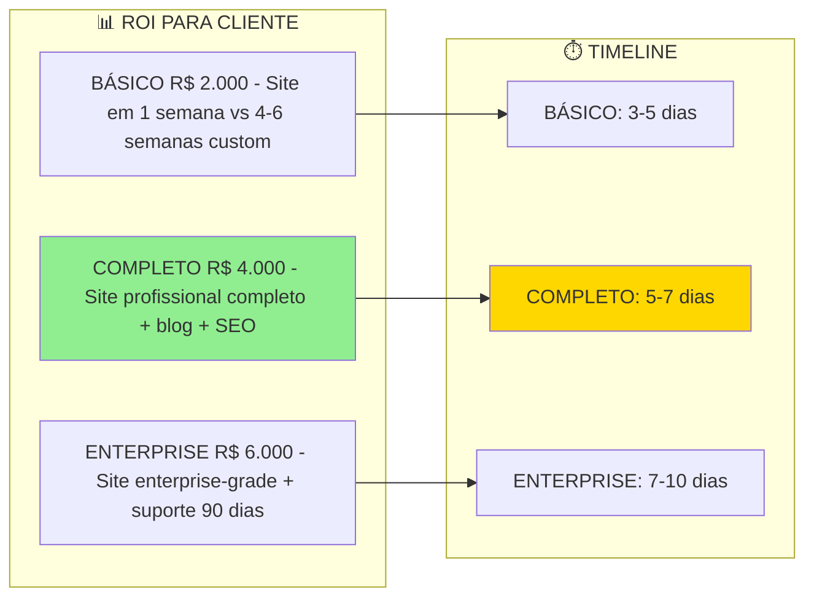

---

## 8. Projeção Financeira Realista

### Cenários de Receita Mês 1-12

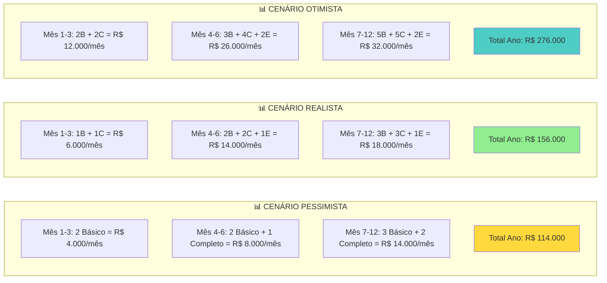

### Tabela de Projeção Mensal (Cenário Realista)

| Mês | Básico (R$ 2k) | Completo (R$ 4k) | Enterprise (R$ 6k) | Total Mensal | Acumulado |
|-----|----------------|------------------|---------------------|--------------|-----------|
| Fev/25 | 1 (R$ 2.000) | 0 | 0 | R$ 2.000 | R$ 2.000 |
| Mar/25 | 1 (R$ 2.000) | 1 (R$ 4.000) | 0 | R$ 6.000 | R$ 8.000 |
| Abr/25 | 2 (R$ 4.000) | 2 (R$ 8.000) | 0 | R$ 12.000 | R$ 20.000 |
| Mai/25 | 2 (R$ 4.000) | 2 (R$ 8.000) | 1 (R$ 6.000) | R$ 18.000 | R$ 38.000 |
| Jun/25 | 2 (R$ 4.000) | 2 (R$ 8.000) | 1 (R$ 6.000) | R$ 18.000 | R$ 56.000 |
| Jul-Nov | 3 (R$ 6.000) | 3 (R$ 12.000) | 1 (R$ 6.000) | R$ 24.000/mês | R$ 156.000 |

**Meta Ano 1:** R$ 156.000 (cenário realista)

---

## 9. Análise de Custos Operacionais

### Stack Tecnológico e Custos

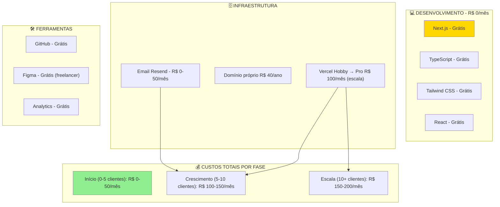

### Margem por Pacote

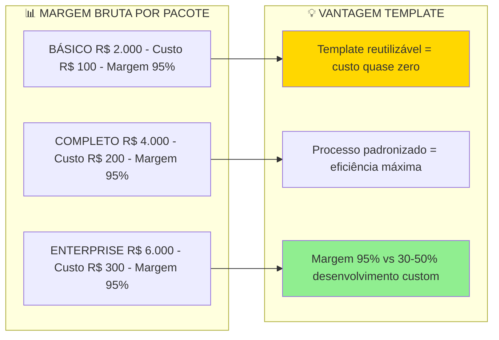

---

# PARTE IV: ESTRATÉGIA COMERCIAL

---

## 10. Funil de Vendas Completo

### Funil Visual com Conversões Realistas

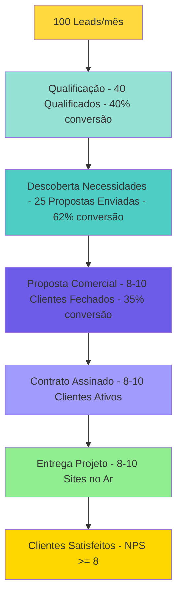

### Processo de Vendas 5 Etapas

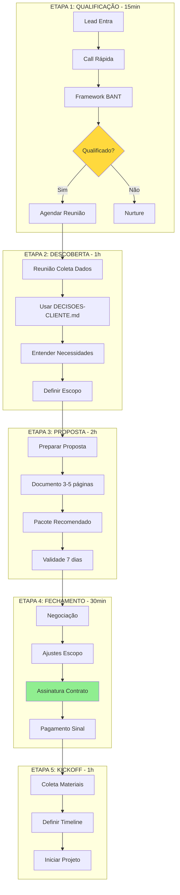

---

## 11. ⭐ Processo de Vendas Guiado

> [!SUCCESS] **DIFERENCIAL EXCLUSIVO UZZBUILDER**
> 
> Processo de vendas totalmente guiado usando checklist profissional de 859 linhas, garantindo coleta completa de informações e reduzindo retrabalho em 80%.

### Fluxo da Vendas Guiada

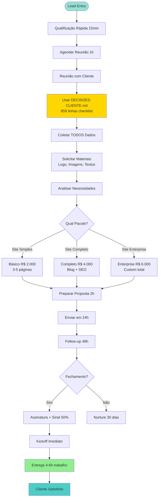

### Métricas Esperadas

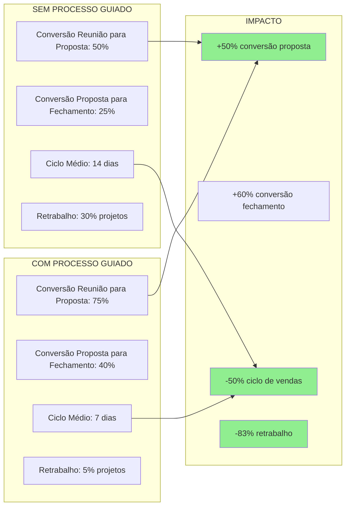

---

## 12. Framework de Qualificação

### Matriz BANT Adaptada

```mermaid
graph TB
    subgraph "B - BUDGET"
        B1["R$ 2.000-6.000 = ✅ FIT"]
        B2["R$ 1.000-2.000 = ⚠️ BORDERLINE"]
        B3["Menor que R$ 1.000 = ❌ NO-FIT"]
    end
    
    subgraph "A - AUTHORITY"
        A1["Você é decisor = ✅ FIT"]
        A2["Precisa aprovação 1 pessoa = ⚠️ BORDERLINE"]
        A3["Comitê 3+ pessoas = ❌ NO-FIT"]
    end
    
    subgraph "N - NEED"
        N1["Precisa site profissional agora = ✅ FIT"]
        N2["Seria bom ter = ⚠️ BORDERLINE"]
        N3["Só curiosidade = ❌ NO-FIT"]
    end
    
    subgraph "T - TIMELINE"
        T1["1-2 semanas = ✅ FIT"]
        T2["1 mês = ⚠️ BORDERLINE"]
        T3["Próximo ano = ❌ NO-FIT"]
    end
    
    subgraph "DECISÃO"
        D1["4/4 = Prioridade ALTA - Proposta 24h"]
        D2["3/4 = Prioridade MÉDIA - Proposta 3-5 dias"]
        D3["2/4 = Nurture conteúdo"]
        D4["1/4 = Descartar"]
    end
    
    B1 --> D1
    A1 --> D1
    N1 --> D1
    T1 --> D1
    
    style B1 fill:#90EE90
    style D1 fill:#90EE90
    style B3 fill:#FF6B6B
    style D4 fill:#FF6B6B
```

---

## 13. Tratamento de Objeções

### 10 Objeções Principais com Respostas

```mermaid
graph TB
    subgraph "💰 OBJEÇÕES DE PREÇO"
        O1["É muito caro → Comparar com desenvolvimento custom R$ 10k-30k"]
        O2["Não temos orçamento → Mostrar ROI e economia vs agência"]
    end
    
    subgraph "⏰ OBJEÇÕES DE TIMING"
        O3["Preciso pensar → Timeline de 1 semana vs 4-6 semanas custom"]
        O4["Preciso de aprovação → Entregar proposta para comitê"]
    end
    
    subgraph "🔧 OBJEÇÕES TÉCNICAS"
        O5["Vou fazer no Wix → Mostrar diferenciais profissional vs amador"]
        O6["Já tenho desenvolvedor → Comparar custo R$ 2k vs R$ 15k custom"]
        O7["Nunca ouvi falar → Mostrar casos de sucesso e processo"]
    end
    
    subgraph "⚠️ OBJEÇÕES DE RISCO"
        O8["Como sei que fica bom → Garantia revisões ilimitadas"]
        O9["E se não gostar → Mostrar portfólio e processo transparente"]
    end
    
    style O1 fill:#90EE90
    style O8 fill:#90EE90
    style O7 fill:#FFD700
```

---

# PARTE V: MARKETING E AQUISIÇÃO

---

## 14. Estratégia de Marketing

### Funil de Marketing Completo

```mermaid
flowchart TB
    subgraph "🎯 AWARENESS - Topo"
        A1["SEO Blog - criação de sites rápidos"]
        A2["Google Ads - site institucional rápido"]
        A3["LinkedIn Organic - posts educacionais"]
        A4["Instagram - casos de sucesso"]
        A5["Parcerias - agências e freelancers"]
    end

    subgraph "🔍 CONSIDERATION - Meio"
        C1["Landing Page - converter visitas"]
        C2["Case Studies - sites entregues"]
        C3["eBook Download - guia criação sites"]
        C4["Webinar - como criar site em 1 semana"]
        C5["Vídeo Demos - processo completo"]
    end

    subgraph "💼 DECISION - Fundo"
        D1["Reunião Discovery - 1h"]
        D2["Proposta Comercial - customizada"]
        D3["Portfólio Completo - exemplos reais"]
        D4["Prova Social - testimonials"]
    end

    subgraph "✅ CONVERSÃO"
        CV1["Assinatura Contrato"]
        CV2["Kickoff Projeto"]
        CV3["Entrega Site"]
    end

    A1 --> C1
    A2 --> C1
    A3 --> C2
    A4 --> C3
    A5 --> C4

    C1 --> D1
    C2 --> D1
    C3 --> D2
    C4 --> D2

    D1 --> CV1
    D2 --> CV1
    D3 --> CV1
    D4 --> CV1

    CV1 --> CV2 --> CV3

    style CV1 fill:#90EE90
```

---

## 15. Canais de Aquisição

### Matriz de Canais Priorizada

```mermaid
quadrantChart
    title Canais de Aquisicao - Esforco vs Resultado
    x-axis Baixo Esforco --> Alto Esforco
    y-axis Baixo Resultado --> Alto Resultado
    quadrant-1 Focar Agora
    quadrant-2 Investir Depois
    quadrant-3 Evitar
    quadrant-4 Manter
    Referrals: [0.2, 0.9]
    LinkedIn Organico: [0.3, 0.8]
    Instagram: [0.35, 0.75]
    Parcerias: [0.5, 0.7]
    SEO Blog: [0.7, 0.85]
    Google Ads: [0.8, 0.65]
    YouTube: [0.85, 0.5]
```

### Priorização de Canais

```mermaid
graph TB
    subgraph "🥇 PRIORIDADE 1 - Foco Agora"
        P1["Referrals - ROI máximo"]
        P2["LinkedIn Orgânico - B2B direto"]
        P3["Instagram - Visual casos sucesso"]
    end
    
    subgraph "🥈 PRIORIDADE 2 - Desenvolver"
        P4["SEO Blog - longo prazo"]
        P5["Parcerias - multiplicador"]
        P6["YouTube - processo educativo"]
    end
    
    subgraph "🥉 PRIORIDADE 3 - Futuro"
        P7["Google Ads - após validar mensagem"]
        P8["Facebook Ads - segmentação específica"]
    end
    
    P1 --> Results["Resultados"]
    P2 --> Results
    P3 --> Results
    
    style P1 fill:#FFD700
    style P2 fill:#90EE90
```

---

## 16. Customer Journey Completo

### Jornada do Cliente Visual

```mermaid
journey
    title Customer Journey - Do Lead ao Advocate
    section Descoberta
      Recebe indicação: 5: Cliente, Advocate
      Vê post LinkedIn: 4: Cliente, Marketing
      Busca no Google: 3: Cliente
      Lê artigo blog: 4: Cliente
    section Consideração
      Acessa Landing Page: 5: Cliente
      Vê casos de sucesso: 5: Cliente, Marketing
      Baixa eBook: 4: Cliente, Marketing
      Agenda reunião: 5: Cliente, Vendas
    section Decisão
      Participa reunião discovery: 5: Cliente, Vendas
      Recebe proposta comercial: 4: Cliente, Vendas
      Negocia condições: 4: Cliente, Vendas
      Assina contrato: 5: Cliente, Jurídico
    section Conversão
      Efetua pagamento: 5: Cliente, Financeiro
      Fornece materiais: 5: Cliente
      Recebe site pronto: 5: Cliente, Técnico
      Site no ar: 5: Cliente, Técnico
    section Retenção
      Usa site diariamente: 5: Cliente
      Recebe suporte: 5: Cliente, Suporte
      Solicita ajustes: 4: Cliente, Técnico
      Renova manutenção: 5: Cliente, Vendas
    section Advocacy
      Indica para colega: 5: Cliente, Vendas
      Escreve review positivo: 5: Cliente, Marketing
      Participa case study: 4: Cliente, Marketing
      Vira parceiro: 5: Cliente, Vendas
```

---

# PARTE VI: ANÁLISE COMPETITIVA

---

## 17. Análise de Concorrentes

### Comparação Side-by-Side

```mermaid
graph TB
    subgraph "💰 PREÇO"
        P1["Nós: R$ 2.000-6.000/projeto"]
        P2["Wix/Squarespace: $15-50/mês"]
        P3["Agências: R$ 10.000-50.000"]
        P4["Freelancers: R$ 5.000-15.000"]
        P5["WordPress Themes: R$ 200-500"]
    end
    
    subgraph "⏱️ TEMPO"
        T1["Nós: 4-6 horas (1 semana)"]
        T2["Wix/Squarespace: 10-20 horas"]
        T3["Agências: 4-8 semanas"]
        T4["Freelancers: 2-4 semanas"]
        T5["WordPress Themes: 1-2 semanas"]
    end
    
    subgraph "🎨 QUALIDADE"
        Q1["Nós: Profissional garantida + checklist"]
        Q2["Wix/Squarespace: Amador limitado"]
        Q3["Agências: Alta mas cara"]
        Q4["Freelancers: Variável"]
        Q5["WordPress Themes: Boa mas genérica"]
    end
    
    subgraph "📚 DOCUMENTAÇÃO"
        D1["Nós: Completa 3000+ linhas"]
        D2["Wix/Squarespace: Tutoriais básicos"]
        D3["Agências: Sem documentação"]
        D4["Freelancers: Sem documentação"]
        D5["WordPress Themes: Básica"]
    end
    
    style P1 fill:#90EE90
    style T1 fill:#90EE90
    style Q1 fill:#90EE90
    style D1 fill:#90EE90
```

---

## 18. Sweet Spot de Mercado

### Perfil Ideal vs. Não Ideal

```mermaid
graph TB
    subgraph "✅ SWEET SPOT - CLIENTES IDEAIS"
        SS1["Budget: R$ 2.000 - R$ 6.000"]
        SS2["Timeline: 1-2 semanas"]
        SS3["Necessidade: Site profissional rápido"]
        SS4["Valorizam: Qualidade + Velocidade"]
        SS5["Decisão: Rápida 1 pessoa"]
    end
    
    subgraph "❌ NÃO IDEAL - OUTROS FORNECEDORES"
        N1["Budget < R$ 1.000 → Wix/Squarespace"]
        N2["Budget > R$ 10.000 → Agências grandes"]
        N3["Timeline > 1 mês → Desenvolvimento custom"]
        N4["E-commerce complexo → Shopify/WooCommerce"]
    end
    
    subgraph "📊 SEGMENTOS PRIORITÁRIOS"
        S1["1º Startups"]
        S2["2º Profissionais autônomos"]
        S3["3º Pequenas empresas"]
        S4["4º Agências (template reutilizável)"]
    end
    
    SS1 --> S1
    SS4 --> S2
    SS5 --> S3
    
    style SS1 fill:#90EE90
    style S1 fill:#FFD700
    style N1 fill:#FF6B6B
```

---

## 19. Battle Cards por Concorrente

### Elevator Pitch por Concorrente

```mermaid
mindmap
  root((Battle Cards))
    vs Wix/Squarespace
      Somos Wix mas profissional
      Eles amador limitado nós código profissional
      Eles genérico nós customizado
      Eles você faz nós fazemos para você
      Resultado site profissional entregue rápido
    vs Agências
      Somos agência mas rápido e barato
      Mesma qualidade 1/5 do preço
      10x mais rápido entregar
      Eles 4-8 semanas nós 1 semana
    vs Freelancers
      Somos freelancer mas processo garantido
      Eles improvisam nós checklist completo
      Eles variável nós qualidade garantida
      Documentação completa vs inexistente
    vs WordPress Themes
      Somos WordPress mas Next.js moderno
      Eles PHP antigo nós React moderno
      Eles genérico nós totalmente custom
      Performance superior SEO otimizado
```

---

# PARTE VII: OPERAÇÕES E PROCESSOS

---

## 20. Processo Operacional Padronizado

### Fluxo Completo Cliente → Site

```mermaid
flowchart TD
    Start([Lead Entra]) --> Qualify[Qualificação BANT]
    
    Qualify -->|Qualificado| Schedule[Agendar Reunião]
    Qualify -->|Não| Nurture[Nurture]
    
    Schedule --> Meeting[Reunião Discovery 1h]
    
    Meeting --> Checklist[Usar DECISOES-CLIENTE.md]
    
    Checklist --> Collect[Coletar Dados Completos]
    
    Collect --> Materials[Solicitar Materiais]
    
    Materials --> Proposal[Preparar Proposta 2h]
    
    Proposal --> Send[Enviar Proposta]
    
    Send --> Negotiate{Negociação}
    
    Negotiate -->|Aceita| Contract[Contrato + Sinal 50%]
    Negotiate -->|Não| Follow[Follow-up]
    
    Contract --> Kickoff[Kickoff Projeto]
    
    Kickoff --> Copy[Copiar Skeleton]
    
    Copy --> Config[Preencher site.config.ts 30min]
    
    Config --> Custom[Customizar Visual 2-3h]
    
    Custom --> Validate[Validar Checklist 1h]
    
    Validate --> Build[Build + Deploy 30min]
    
    Build --> Deliver[Entrega + Handoff]
    
    Deliver --> Success[Cliente Satisfeito]
    
    Success --> Review[Review 1 semana]
    
    Review --> Advocate[Cliente vira Advocate]
    
    style Start fill:#95E1D3
    style Checklist fill:#FFD700
    style Deliver fill:#90EE90
    style Success fill:#4ECDC4
```

---

## 21. Checklist de Qualidade

### Validação Completa Antes de Entrega

```mermaid
graph TB
    subgraph "✅ CHECKLIST TÉCNICO"
        T1["Build local OK ✅"]
        T2["Todos links funcionam ✅"]
        T3["Formulário envio email ✅"]
        T4["Mobile responsivo ✅"]
        T5["SEO básico configurado ✅"]
    end
    
    subgraph "✅ CHECKLIST VISUAL"
        V1["Cores aplicadas corretamente ✅"]
        V2["Logo aparece header/footer ✅"]
        V3["Favicon configurado ✅"]
        V4["Imagens otimizadas < 200KB ✅"]
        V5["Typography consistente ✅"]
    end
    
    subgraph "✅ CHECKLIST CONTEÚDO"
        C1["Sem placeholders Lorem Ipsum ✅"]
        C2["Textos revisados português ✅"]
        C3["Contatos corretos ✅"]
        C4["Redes sociais linkadas ✅"]
        C5["SEO metadata preenchido ✅"]
    end
    
    subgraph "✅ CHECKLIST PERFORMANCE"
        P1["Lighthouse Score > 85 ✅"]
        P2["Images lazy loading ✅"]
        P3["Fonts otimizadas ✅"]
        P4["Code splitting OK ✅"]
    end
    
    T1 --> QA[QUALIDADE APROVADA]
    V1 --> QA
    C1 --> QA
    P1 --> QA
    
    QA --> Deliver[ENTREGAR]
    
    style QA fill:#90EE90
    style Deliver fill:#FFD700
```

---

# PARTE VIII: RISCOS E MITIGAÇÃO

---

## 22. Matriz de Riscos

### Riscos Principais

```mermaid
graph TB
    subgraph "🔴 RISCOS CRÍTICOS - Sev >= 20"
        R1["R-001: Cliente não fornece materiais - Prob: 4 Impact: 5 Sev: 20"]
        R2["R-002: Mudanças escopo constante - Prob: 3 Impact: 5 Sev: 15"]
    end
    
    subgraph "🟡 RISCOS ALTOS - Sev 12-19"
        R3["R-003: Deploy falha - Prob: 2 Impact: 4 Sev: 8"]
        R4["R-004: Cliente insatisfeito design - Prob: 3 Impact: 4 Sev: 12"]
    end
    
    subgraph "🟢 RISCOS MÉDIOS - Sev < 12"
        R5["R-005: Atraso entrega materiais - Prob: 3 Impact: 3 Sev: 9"]
        R6["R-006: Mudanças após entrega - Prob: 2 Impact: 3 Sev: 6"]
    end
    
    subgraph "✅ MITIGAÇÕES"
        M1["Checklist completo coleta TODOS materiais"]
        M2["Contrato claro escopo + 1 revisão incluída"]
        M3["Processo deploy testado e documentado"]
        M4["Mostrar exemplos antes desenvolvimento"]
        M5["Timeline realista com buffer"]
        M6["Suporte 30 dias incluído pacotes"]
    end
    
    R1 --> M1
    R2 --> M2
    R3 --> M3
    R4 --> M4
    R5 --> M5
    R6 --> M6
    
    style R1 fill:#FF6B6B
    style M1 fill:#90EE90
```

---

## 23. Plano de Contingência

### Contingências por Cenário

```mermaid
flowchart TD
    subgraph "SE: Cliente Não Fornece Materiais > 7 dias"
        A1["Criar mockups com placeholders"]
        A2["Usar cores/fontes genéricas"]
        A3["Entregar parcial + espera"]
    end
    
    subgraph "SE: Deploy Falha"
        B1["Troubleshooting imediato"]
        B2["Backup hosting alternativo"]
        B3["Rollback para versão anterior"]
    end
    
    subgraph "SE: Cliente Insatisfeito Design"
        C1["Revisão incluída usar"]
        C2["Mostrar opções alternativas"]
        C3["Ajustes rápidos 24h"]
    end
    
    subgraph "SE: Mudanças Escopo Constante"
        D1["Relembrar escopo contrato"]
        D2["Oferecer add-on customização"]
        D3["Timeline estendido"]
    end
    
    style A1 fill:#FFD93D
    style C1 fill:#FFD93D
```

---

# PARTE IX: MÉTRICAS E EXPANSÃO

---

## 24. KPIs e Métricas de Sucesso

### Dashboard de KPIs Completo

```mermaid
graph TB
    subgraph "💰 MÉTRICAS FINANCEIRAS"
        F1["Receita Mensal - Meta: R$ 18.000/mês até Jun/2025"]
        F2["Receita Anual - Meta: R$ 156.000 até Dez/2025"]
        F3["Ticket Médio - Meta: R$ 4.000"]
        F4["Margem Bruta - Meta: >= 95%"]
        F5["LTV Cliente - Meta: R$ 4.000-6.000"]
    end

    subgraph "⚡ MÉTRICAS OPERACIONAIS"
        O1["Tempo Médio Projeto - Meta: 5 dias"]
        O2["Projetos/Mês - Meta: 5-6"]
        O3["Taxa Conversão - Meta: 35%"]
        O4["NPS - Meta: >= 8.0"]
        O5["Taxa Retrabalho - Meta: < 5%"]
    end

    subgraph "📊 MÉTRICAS QUALIDADE"
        Q1["Lighthouse Score - Meta: >= 85"]
        Q2["Bugs por Projeto - Meta: 0 críticos"]
        Q3["Satisfação Cliente - Meta: >= 9/10"]
        Q4["Recomendação - Meta: >= 90%"]
    end

    subgraph "📈 MÉTRICAS CRESCIMENTO"
        G1["Novos Clientes/Mês - Meta: 5-6"]
        G2["Taxa Crescimento - Meta: 20% mês/mês"]
        G3["Referrals/Mês - Meta: 1 a cada 5 clientes"]
    end

    F5 -.->|Impacta| G2
    O5 -.->|Impacta| Q3
    Q3 -.->|Impacta| G3

    style F5 fill:#FFD700
    style O5 fill:#90EE90
    style Q3 fill:#90EE90
```

---

## 25. Roadmap de Expansão 2025-2026

### Timeline de Expansão

```mermaid
timeline
    title Roadmap de Expansão - 2025-2026

    section Q1 2025 (Jan-Mar)
    Validação Mercado: Primeiros 10 clientes
                     : Casos de sucesso
                     : Feedback incorporado
                     : Processo refinado

    section Q2 2025 (Abr-Jun)
    Escala Inicial: 5-6 clientes/mês
                  : Landing Page própria
                  : Marketing ativo
                  : Parcerias estratégicas

    section Q3 2025 (Jul-Set)
    Expansão: Add-ons customizações
            : Templates especializados
            : Integrações comuns
            : Suporte premium

    section Q4 2025 (Out-Dez)
    Consolidação: 6-8 clientes/mês
                : Processo totalmente otimizado
                : Documentação completa
                : Community building

    section 2026
    Evolução: Marketplace templates
            : Licenças reutilizáveis
            : Franchising modelo
            : Internacionalização
```

---

# 📊 RESUMO EXECUTIVO R01

## Visão Consolidada

O **UzzBuilder (Template Skeleton)** é um sistema completo e operacional para criação rápida de sites institucionais, permitindo entregas profissionais em **4-6 horas** de trabalho (1 semana calendário).

### ✅ PONTOS FORTES

| Categoria | Detalhe |
|-----------|---------|
| **Template** | 100% completo, componentes parametrizáveis, arquitetura moderna |
| **Processo** | Totalmente documentado e padronizado (4-6h validado) |
| **Documentação** | 3000+ linhas: Guias, Checklists, Arquitetura completa |
| **Diferenciais** | Único template 100% parametrizável com processo guiado |
| **Projeção** | R$ 156.000 ano 1 (cenário realista) |
| **Margem** | 95% (custo operacional quase zero) |

### ⚠️ DESAFIOS

| Desafio | Mitigação |
|---------|-----------|
| Marca nova | Casos de sucesso rápidos, processo comprovado |
| Concorrência | Diferenciais únicos: template + processo + documentação |
| Escala | Processo padronizado permite 5+ clientes/mês |

### 🎯 PRÓXIMOS PASSOS CRÍTICOS

| Data | Marco | Responsável |
|------|-------|-------------|
| Fev/25 | Primeiros Clientes Teste | Equipe |
| Mar/25 | Casos de Sucesso Documentados | Marketing |
| Abr/25 | Landing Page UzzBuilder | Desenvolvimento |
| Mai/25 | Marketing Ativo | Marketing |

### 📈 METAS ANO 1

| Métrica | Meta |
|---------|------|
| Receita | R$ 156.000 (cenário realista) |
| Clientes | 3 Básico + 3 Completo + 1 Enterprise/mês (média) |
| Receita Mensal Final | R$ 24.000/mês |
| Início Operações | **Fevereiro 2025** |
| Escala Completa | Junho 2025 |

---

**📅 Versão**: R01  
**📅 Criado**: 26/01/2025  
**👤 Responsável**: Equipe UzzBuilder  
**🔗 Baseado em**: `PLANO_NEGOCIO_COMPLETO_VISUAL_R02.md`, `Arquitetura_UzzBuilder.md`, `GUIA-USO-SKELETON.md`, `FILOSOFIA-SKELETON.md`

---

> [!SUCCESS] **DOCUMENTO COMPLETO E ESTRATÉGICO**
> 
> Este documento R01 consolida **TODA** a estratégia de negócio do UzzBuilder (Template Skeleton), incorporando arquitetura completa, processos validados e modelo financeiro realista. Destinado para uso em decisões estratégicas, planejamento operacional e crescimento do negócio.

