# 🏗️ Arquitetura do Sistema UzzBuilder

> **Documentação completa da arquitetura do Template Skeleton em Mermaid**  
> Sistema de construção rápida de sites institucionais com Next.js 15 + TypeScript + Monorepo

## 📋 Índice

1. [Arquitetura Geral do Sistema](#1-arquitetura-geral-do-sistema)
2. [Modelo de Negócio](#2-modelo-de-negócio)
3. [Arquitetura Frontend](#3-arquitetura-frontend)
4. [Arquitetura de Componentes](#4-arquitetura-de-componentes)
5. [Sistema de Configuração](#5-sistema-de-configuração)
6. [Fluxo de Desenvolvimento](#6-fluxo-de-desenvolvimento)
7. [Monorepo Structure](#7-monorepo-structure)
8. [Build e Deploy](#8-build-e-deploy)
9. [Stack Tecnológica](#9-stack-tecnológica)

---

## 1. Arquitetura Geral do Sistema

### Visão de Alto Nível

```mermaid
graph TB
    subgraph "Entrada: Dados do Cliente"
        A[Reunião com Cliente]
        B[DECISOES-CLIENTE.md]
        C[Assets: Logo, Imagens]
    end
    
    subgraph "Template Skeleton (Base Universal)"
        D[Estrutura Monorepo]
        E[Componentes Parametrizáveis]
        F[Sistema de Design Tokens]
        G[Configurações TypeScript]
    end
    
    subgraph "Processo de Customização"
        H[Preencher site.config.ts]
        I[Adicionar Assets]
        J[Customizar Cores]
        K[Montar Páginas]
    end
    
    subgraph "Resultado: Site do Cliente"
        L[Next.js App Router]
        M[Páginas Customizadas]
        N[Componentes Aplicados]
    end
    
    subgraph "Deploy"
        O[Build Estático/SSR]
        P[Vercel/Hosting]
        Q[Site no Ar]
    end
    
    A --> B
    B --> H
    C --> I
    D --> H
    E --> K
    F --> J
    G --> K
    H --> K
    I --> K
    J --> K
    K --> L
    L --> M
    M --> N
    N --> O
    O --> P
    P --> Q

    style A fill:#e1f5ff
    style D fill:#bbdefb
    style H fill:#fff9c4
    style L fill:#c8e6c9
    style Q fill:#f8bbd0
```

### Modelo de Valor

```mermaid
graph LR
    subgraph "ANTES (Sem Skeleton)"
        A1[Template Universal<br/>8-10 horas<br/>Risco de erros]
    end
    
    subgraph "DEPOIS (Com Skeleton)"
        A2[Template Skeleton<br/>4-6 horas<br/>Checklist guiado]
    end
    
    subgraph "Entrada"
        B[Cliente com Dados]
    end
    
    subgraph "Processo"
        C[Configuração<br/>30min]
        D[Customização<br/>2-3h]
        E[Validação<br/>1h]
        F[Deploy<br/>30min]
    end
    
    subgraph "Saída"
        G[Site Profissional<br/>100% Funcional]
    end
    
    B --> A1
    B --> A2
    A1 --> C
    A2 --> C
    C --> D
    D --> E
    E --> F
    F --> G

    style A1 fill:#ffccbc
    style A2 fill:#c8e6c9
    style G fill:#f8bbd0
```

---

## 2. Modelo de Negócio

### Fluxo de Negócio Completo

```mermaid
sequenceDiagram
    participant Cliente
    participant Dev as Desenvolvedor
    participant Reuniao as Reunião<br/>DECISOES-CLIENTE.md
    participant Skeleton as Template Skeleton
    participant Config as site.config.ts
    participant Build as Build Process
    participant Deploy as Deploy
    participant Site as Site no Ar
    
    Cliente->>Dev: Solicita Site
    Dev->>Reuniao: Agenda Reunião
    Reuniao->>Cliente: Coleta Dados (1h)
    Cliente->>Dev: Fornece Materiais
    Dev->>Skeleton: Copia Template
    Dev->>Config: Preenche Dados
    Dev->>Skeleton: Customiza Visual
    Dev->>Build: Executa Build
    Build->>Deploy: Gera Site
    Deploy->>Site: Publica
    Site->>Cliente: Entrega (4-6h total)
```

### Estrutura de Dados do Cliente


### Ciclo de Vida do Projeto

```mermaid
gantt
    title Ciclo de Vida: Cliente → Site (4-6 horas)
    dateFormat HH:mm
    axisFormat %H:%M
    
    section Preparação
    Reunião com Cliente          :a1, 00:00, 1h
    Receber Materiais            :a2, after a1, 30m
    
    section Configuração
    Copiar Skeleton              :b1, after a2, 10m
    Preencher site.config.ts     :b2, after b1, 20m
    Configurar .env.local        :b3, after b2, 10m
    
    section Customização
    Cores e Design Tokens        :c1, after b3, 20m
    Logo e Favicons              :c2, after c1, 15m
    Assets e Imagens             :c3, after c2, 30m
    Montar Páginas               :c4, after c3, 1h30m
    
    section Validação
    Testes Locais                :d1, after c4, 30m
    Lighthouse Audit             :d2, after d1, 15m
    Correções                    :d3, after d2, 15m
    
    section Deploy
    Build Produção               :e1, after d3, 10m
    Deploy Vercel                :e2, after e1, 10m
    Configurar Domínio           :e3, after e2, 10m
```

---

## 3. Arquitetura Frontend

### Estrutura de Páginas e Rotas

```mermaid
graph TD
    A[App Router Next.js 15] --> B{Layout System}
    B --> C[Root Layout]
    B --> D[Locale Layout]
    
    C --> E[Metadata Global]
    C --> F[Fonts Provider]
    C --> G[Theme Provider]
    
    D --> H[Home /]
    D --> I[Sobre /sobre]
    D --> J[Serviços /servicos]
    D --> K[Contato /contato]
    
    H --> H1[HeroSection]
    H --> H2[ServicesSection]
    H --> H3[AboutSection]
    H --> H4[ContactSection]
    
    I --> I1[AboutContent]
    I --> I2[TeamSection]
    
    J --> J1[ServicesList]
    
    K --> K1[ContactForm]
    K --> K2[MapSection]

    style A fill:#e3f2fd
    style C fill:#c5cae9
    style D fill:#fff9c4
    style H fill:#c8e6c9
```

### Component Architecture (Hierarquia)

```mermaid
graph TB
    subgraph "Root Level"
        A[app/[locale]/layout.tsx]
    end
    
    subgraph "Layout Components"
        B[Header]
        C[Footer]
        D[MainLayout]
    end
    
    subgraph "Page Sections"
        E[HeroSection]
        F[ServicesSection]
        G[AboutSection]
        H[ContactSection]
        I[TeamSection]
        J[StatsSection]
    end
    
    subgraph "UI Components (@template/ui)"
        K[Button]
        L[Card]
        M[Input]
        N[Dialog]
        O[Badge]
    end
    
    subgraph "Design System"
        P[Design Tokens]
        Q[Theme Colors]
        R[Typography]
    end
    
    A --> D
    D --> B
    D --> C
    D --> E
    D --> F
    D --> G
    D --> H
    D --> I
    D --> J
    
    E --> K
    F --> L
    G --> L
    H --> M
    H --> N
    
    B --> K
    C --> O
    
    E --> P
    F --> P
    G --> P
    H --> P
    
    P --> Q
    P --> R

    style A fill:#e3f2fd
    style D fill:#fff9c4
    style K fill:#c8e6c9
    style P fill:#f8bbd0
```

---

## 4. Arquitetura de Componentes

### Sistema de Componentes Parametrizáveis

```mermaid
graph TB
    subgraph "Componentes Primitivos (100% Parametrizáveis)"
        A[Button<br/>variant, size, href]
        B[Card<br/>composição livre]
        C[Input<br/>todas props nativas]
        D[Badge<br/>variant, children]
        E[Dialog<br/>Radix UI base]
        F[Accordion<br/>items configuráveis]
    end
    
    subgraph "Componentes Especializados"
        G[ModernHero<br/>title, subtitle, video, CTAs]
        H[FlipBox<br/>frontContent, backContent]
        I[EmojiIcon<br/>emoji, aria-label]
        J[LazySection<br/>fallback, children]
    end
    
    subgraph "Seções de Página"
        K[TeamSection<br/>members array]
        L[BlogListSection<br/>posts array]
        M[TestimonialsSection<br/>testimonials array]
    end
    
    subgraph "Fonte de Dados"
        N[site.config.ts<br/>Centralizado]
    end
    
    N --> G
    N --> K
    N --> L
    N --> M
    
    A --> G
    B --> K
    C --> M
    D --> L

    style A fill:#e1f5fe
    style G fill:#fff9c4
    style K fill:#c8e6c9
    style N fill:#f8bbd0
```

### Fluxo de Dados: Config → Componentes


### Matriz de Componentes vs. Customizabilidade

```mermaid
graph LR
    subgraph "100% Parametrizável ✅"
        A[Button<br/>Card<br/>Input<br/>Badge<br/>Dialog]
    end
    
    subgraph "90-95% Parametrizável ✅"
        B[ModernHero<br/>TeamSection<br/>BlogListSection<br/>TestimonialsSection]
    end
    
    subgraph "50-80% Parametrizável ⚠️"
        C[Header<br/>Footer<br/>ContactSection]
    end
    
    subgraph "0-20% Parametrizável ❌"
        D[AboutSection<br/>ServicesSection<br/>FAQSection]
    end
    
    A -->|Uso Imediato| E[Site do Cliente]
    B -->|Uso com Config| E
    C -->|Edição Manual| E
    D -->|Criar Custom| E

    style A fill:#c8e6c9
    style B fill:#fff9c4
    style C fill:#ffccbc
    style D fill:#f8bbd0
```

---

## 5. Sistema de Configuração

### Estrutura do site.config.ts

```mermaid
graph TB
    A[site.config.ts] --> B[identity<br/>nome, tagline, descrição]
    A --> C[urls<br/>production, staging]
    A --> D[contact<br/>email, phone, address]
    A --> E[social<br/>instagram, linkedin, etc]
    A --> F[navigation<br/>main, cta, footer]
    A --> G[hero<br/>title, subtitle, CTAs]
    A --> H[services<br/>array de serviços]
    A --> I[team<br/>membros da equipe]
    A --> J[projects<br/>cases/portfólio]
    A --> K[testimonials<br/>depoimentos]
    A --> L[faq<br/>perguntas frequentes]
    A --> M[integrations<br/>GA, Pixel, Chat]
    A --> N[seo<br/>keywords, metadata]
    A --> O[i18n<br/>idiomas]
    A --> P[features<br/>newsletter, dark mode]
    
    style A fill:#f8bbd0
    style B fill:#e3f2fd
    style G fill:#fff9c4
    style H fill:#c8e6c9
```

### Fluxo: Dados do Cliente → Config → Site

```mermaid
graph LR
    subgraph "Fonte"
        A[Reunião Cliente<br/>DECISOES-CLIENTE.md]
        B[Assets Recebidos<br/>Logo, Imagens]
    end
    
    subgraph "Transformação"
        C[Preencher<br/>site.config.ts]
        D[Organizar<br/>Assets em /public]
    end
    
    subgraph "Aplicação"
        E[Componentes<br/>Lêem Config]
        F[Páginas<br/>Montam Seções]
    end
    
    subgraph "Resultado"
        G[Site Customizado<br/>100% do Cliente]
    end
    
    A --> C
    B --> D
    C --> E
    D --> F
    E --> F
    F --> G

    style A fill:#e1f5ff
    style C fill:#fff9c4
    style E fill:#c8e6c9
    style G fill:#f8bbd0
```

### Validação e Type Safety

```mermaid
graph TB
    A[site.config.ts] --> B[TypeScript Types]
    B --> C[Compile Time<br/>Type Checking]
    C --> D{Validação}
    D -->|✅ Válido| E[Build Sucesso]
    D -->|❌ Erro| F[TypeScript Error]
    F --> G[Corrigir Config]
    G --> A
    
    B --> H[Autocomplete IDE]
    B --> I[Documentação<br/>Inline]

    style A fill:#f8bbd0
    style B fill:#c8e6c9
    style D fill:#fff9c4
    style E fill:#c8e6c9
```

---

## 6. Fluxo de Desenvolvimento

### Workflow Completo (Cliente → Site)

```mermaid
graph TB
    subgraph "FASE 1: Coleta (1h)"
        A1[Reunião com Cliente]
        A2[Usar DECISOES-CLIENTE.md]
        A3[Coletar Dados]
        A4[Solicitar Materiais]
    end
    
    subgraph "FASE 2: Setup (30min)"
        B1[Copiar Skeleton]
        B2[Instalar Dependências]
        B3[Inicializar Git]
    end
    
    subgraph "FASE 3: Configuração (30min)"
        C1[Preencher site.config.ts]
        C2[Configurar .env.local]
        C3[Testar Build Local]
    end
    
    subgraph "FASE 4: Customização (2-3h)"
        D1[Cores - Design Tokens]
        D2[Logo e Favicons]
        D3[Assets e Imagens]
        D4[Montar Páginas]
        D5[Aplicar Componentes]
    end
    
    subgraph "FASE 5: Validação (1h)"
        E1[Testes Locais]
        E2[Lighthouse Audit]
        E3[Correções]
    end
    
    subgraph "FASE 6: Deploy (30min)"
        F1[Build Produção]
        F2[Deploy Vercel]
        F3[Configurar Domínio]
    end
    
    subgraph "FASE 7: Entrega (30min)"
        G1[Documentação Handoff]
        G2[Treinar Cliente]
        G3[Coletar Feedback]
    end
    
    A1 --> A2
    A2 --> A3
    A3 --> A4
    A4 --> B1
    B1 --> B2
    B2 --> B3
    B3 --> C1
    C1 --> C2
    C2 --> C3
    C3 --> D1
    D1 --> D2
    D2 --> D3
    D3 --> D4
    D4 --> D5
    D5 --> E1
    E1 --> E2
    E2 --> E3
    E3 --> F1
    F1 --> F2
    F2 --> F3
    F3 --> G1
    G1 --> G2
    G2 --> G3

    style A1 fill:#e1f5ff
    style C1 fill:#fff9c4
    style D4 fill:#c8e6c9
    style F2 fill:#f8bbd0
```

### Pipeline de Build (Turborepo)

```mermaid
graph TB
    A[pnpm build] --> B[Turborepo<br/>Orchestrator]
    B --> C[@template/core<br/>TypeCheck]
    B --> D[@template/design-tokens<br/>Build CSS]
    B --> E[@template/ui<br/>Build Components]
    B --> F[apps/web<br/>Next.js Build]
    
    C --> G[Success?]
    D --> G
    E --> G
    G -->|✅ Yes| F
    G -->|❌ No| H[Error]
    H --> I[Fix Issues]
    I --> A
    
    F --> J[Static Export<br/>ou SSR]
    J --> K[Output: out/]
    K --> L[Deploy Ready]

    style A fill:#e1f5ff
    style B fill:#fff9c4
    style F fill:#c8e6c9
    style K fill:#f8bbd0
```

---

## 7. Monorepo Structure

### Estrutura de Packages

```mermaid
graph TB
    subgraph "Monorepo Root"
        A[template-skeleton/]
    end
    
    subgraph "Packages (Reutilizáveis)"
        B[@template/core<br/>Types & Utils]
        C[@template/design-tokens<br/>Themes & Colors]
        D[@template/ui<br/>UI Components]
    end
    
    subgraph "Apps (Aplicações)"
        E[apps/web<br/>Next.js App]
    end
    
    subgraph "Documentação"
        F[docs/<br/>Guides & Docs]
        G[*.md<br/>README, Guias]
    end
    
    A --> B
    A --> C
    A --> D
    A --> E
    A --> F
    A --> G
    
    E -->|imports| B
    E -->|imports| C
    E -->|imports| D
    
    D -->|depends on| C
    D -->|depends on| B

    style A fill:#e3f2fd
    style B fill:#bbdefb
    style C fill:#fff9c4
    style D fill:#c8e6c9
    style E fill:#f8bbd0
```

### Dependências entre Packages


### Workspace Configuration


---

## 8. Build e Deploy

### Build Process (Next.js)


### Deployment Architecture


### CI/CD Pipeline (Opcional)

```mermaid
graph TB
    A[Git Push] --> B[GitHub Repository]
    B --> C{Trigger CI?}
    C -->|Main Branch| D[Vercel Auto Deploy]
    C -->|PR| E[Preview Deploy]
    
    D --> F[Build Pipeline]
    E --> F
    F --> G[Run Tests]
    G --> H[Type Check]
    H --> I[Lint]
    I --> J{Build Success?}
    J -->|✅ Yes| K[Deploy to Production]
    J -->|❌ No| L[Notify Developer]
    L --> M[Fix Issues]
    M --> A
    
    K --> N[Production URL]
    E --> O[Preview URL]

    style A fill:#e1f5ff
    style D fill:#c8e6c9
    style K fill:#f8bbd0
```

---

## 9. Stack Tecnológica

### Technology Stack Completo

```mermaid
graph TB
    subgraph "Frontend Framework"
        A[Next.js 15.5.4<br/>App Router]
        B[React 19.2.0]
        C[TypeScript 5.7.3]
    end
    
    subgraph "Styling"
        D[Tailwind CSS 4.1.14]
        E[CSS Variables<br/>Design Tokens]
        F[Framer Motion<br/>Animations]
    end
    
    subgraph "UI Components"
        G[Radix UI<br/>Primitives]
        H[Shadcn/ui<br/>Patterns]
        I[Lucide Icons]
    end
    
    subgraph "Internationalization"
        J[next-intl 3.23.2<br/>i18n]
    end
    
    subgraph "Monorepo Tools"
        K[Turborepo 2.5.8<br/>Build System]
        L[pnpm 10.18.0<br/>Package Manager]
    end
    
    subgraph "Deployment"
        M[Vercel<br/>Hosting]
        N[Edge Network<br/>CDN]
    end
    
    A --> B
    A --> C
    A --> D
    A --> J
    D --> E
    B --> F
    B --> G
    G --> H
    H --> I
    K --> L
    A --> M
    M --> N

    style A fill:#000000,color:#fff
    style B fill:#61dafb
    style C fill:#3178c6
    style D fill:#38bdf8
    style K fill:#f9ad00
    style M fill:#000000,color:#fff
```

### Dependencies Graph

```mermaid
graph TB
    subgraph "Core Dependencies"
        A[react]
        B[react-dom]
        C[next]
        D[typescript]
    end
    
    subgraph "UI Dependencies"
        E[@radix-ui/react-*]
        F[framer-motion]
        G[lucide-react]
        H[tailwindcss]
    end
    
    subgraph "Utilities"
        I[clsx]
        J[tailwind-merge]
        K[class-variance-authority]
        L[zod]
    end
    
    subgraph "Dev Dependencies"
        M[eslint]
        N[@types/*]
        O[autoprefixer]
    end
    
    C --> A
    C --> B
    A --> E
    A --> F
    E --> G
    C --> H
    A --> I
    I --> J
    J --> K
    C --> L

    style C fill:#000000,color:#fff
    style A fill:#61dafb
    style E fill:#c8e6c9
```

---

## 📊 Métricas e Performance

### Performance Optimizations

```mermaid
graph TB
    subgraph "Frontend Optimizations"
        A[Code Splitting<br/>Route-based]
        B[Lazy Loading<br/>Components]
        C[Image Optimization<br/>Next/Image]
        D[Font Optimization<br/>next/font]
    end
    
    subgraph "Build Optimizations"
        E[Tree Shaking<br/>Unused Code]
        F[Minification<br/>JS/CSS]
        G[Compression<br/>Gzip/Brotli]
        H[Static Generation<br/>SSG]
    end
    
    subgraph "Runtime Optimizations"
        I[Edge Middleware<br/>Vercel]
        J[CDN Caching<br/>Static Assets]
        K[HTTP/2<br/>Multiplexing]
    end
    
    subgraph "Results"
        L[Performance Score<br/>> 85]
        M[First Contentful Paint<br/>< 1.5s]
        N[Time to Interactive<br/>< 3.5s]
    end
    
    A --> L
    B --> M
    C --> M
    D --> M
    E --> L
    F --> L
    G --> L
    H --> M
    I --> N
    J --> M
    K --> N

    style L fill:#c8e6c9
    style M fill:#c8e6c9
    style N fill:#c8e6c9
```

---

## 🔒 Segurança e Qualidade

### Security Measures

```mermaid
graph TB
    subgraph "Code Security"
        A[TypeScript<br/>Type Safety]
        B[ESLint<br/>Code Quality]
        C[Dependency Scanning<br/>npm audit]
    end
    
    subgraph "Runtime Security"
        D[HTTPS Only<br/>TLS/SSL]
        E[Content Security Policy<br/>CSP Headers]
        F[Environment Variables<br/>Secrets Management]
    end
    
    subgraph "Data Protection"
        G[Input Validation<br/>Zod Schemas]
        H[XSS Protection<br/>React Escaping]
        I[CSRF Protection<br/>Next.js Built-in]
    end
    
    A --> J[Safe Code]
    B --> J
    C --> J
    D --> K[Secure Transport]
    E --> K
    F --> K
    G --> L[Safe Data]
    H --> L
    I --> L

    style J fill:#c8e6c9
    style K fill:#fff9c4
    style L fill:#f8bbd0
```

---

## 📝 Fluxos de Dados Principais

### Fluxo: Reunião → Config → Site

```mermaid
sequenceDiagram
    participant Cliente
    participant Reuniao as Reunião<br/>DECISOES-CLIENTE.md
    participant Config as site.config.ts
    participant Component as Component
    participant Page as Page
    participant Site as Site Rendered
    
    Cliente->>Reuniao: Fornece Dados
    Reuniao->>Config: Transforma em Config
    Config->>Component: Props via Config
    Component->>Component: Renderiza UI
    Component->>Page: Composição
    Page->>Site: Output Final
    
    Note over Config,Site: Unidirectional Flow<br/>Config → Components → Render
```

### Fluxo: Customização Visual

```mermaid
graph LR
    A[Design Tokens<br/>themes.css] --> B[CSS Variables]
    B --> C[Tailwind Classes]
    C --> D[Component Styles]
    D --> E[Rendered UI]
    
    F[Logo/Assets<br/>/public/images] --> G[Next/Image]
    G --> E
    
    H[site.config.ts<br/>Colors] --> A
    H --> F

    style A fill:#fff9c4
    style F fill:#c8e6c9
    style E fill:#f8bbd0
```

---

## 🎯 Princípios Arquiteturais

### Design Principles

```mermaid
graph TB
    subgraph "1. Minimalismo"
        A[Apenas o Essencial<br/>Zero Opinião sobre Conteúdo]
    end
    
    subgraph "2. Configuração > Código"
        B[Dados via site.config.ts<br/>Não Hardcoded]
    end
    
    subgraph "3. Parametrizabilidade"
        C[100% via Props<br/>Sem Valores Fixos]
    end
    
    subgraph "4. Documentação Abundante"
        D[Guias Completos<br/>Checklists]
    end
    
    subgraph "5. Velocidade"
        E[4-6h Setup<br/>Processo Guiado]
    end
    
    A --> F[Template Skeleton]
    B --> F
    C --> F
    D --> F
    E --> F

    style F fill:#f8bbd0
```

---

## 📚 Documentação e Guias

### Estrutura de Documentação

```mermaid
graph TB
    A[README.md<br/>Visão Geral] --> B[INDEX.md<br/>Índice Navegável]
    
    B --> C[FILOSOFIA-SKELETON.md<br/>Por que existe]
    B --> D[GUIA-USO-SKELETON.md<br/>Tutorial Completo]
    B --> E[DECISOES-CLIENTE.md<br/>Checklist Reunião]
    B --> F[COMPONENTES-DISPONIVEIS.md<br/>Catálogo]
    
    D --> G[FASE 1: Preparação]
    D --> H[FASE 2: Coleta]
    D --> I[FASE 3: Configuração]
    D --> J[FASE 4: Customização]
    D --> K[FASE 5: Validação]
    D --> L[FASE 6: Deploy]
    D --> M[FASE 7: Entrega]
    
    F --> N[Componentes Primitivos]
    F --> O[Componentes Especializados]
    F --> P[Seções de Página]

    style A fill:#e3f2fd
    style D fill:#fff9c4
    style E fill:#c8e6c9
```

---

## 🔄 Ciclo de Melhoria Contínua

### Feedback Loop

```mermaid
graph LR
    A[Template Skeleton<br/>v1.0] --> B[Uso em Projetos]
    B --> C[Feedback Clientes]
    B --> D[Feedback Devs]
    C --> E[Melhorias]
    D --> E
    E --> F[Template Skeleton<br/>v1.1]
    F --> B
    
    G[template-universal<br/>Referência] --> H[Novos Componentes]
    H --> I[Validação]
    I --> J{100% Parametrizável?}
    J -->|✅ Sim| F
    J -->|❌ Não| K[Mantém em Universal]

    style A fill:#e1f5ff
    style F fill:#c8e6c9
    style G fill:#fff9c4
```

---

## 📝 Considerações Finais

### Padrões Arquiteturais Utilizados

1. **Monorepo Architecture**: Gerenciamento centralizado com Turborepo
2. **Component-Based**: Componentes reutilizáveis e modulares
3. **Configuration-Driven**: Dados centralizados em `site.config.ts`
4. **Design System**: Tokens de design via CSS Variables
5. **Type Safety**: TypeScript rigoroso em todo o projeto
6. **Documentation-First**: Documentação completa antes de código
7. **Minimalism**: Apenas o essencial, zero opinião sobre conteúdo

### Princípios de Design

- **DRY (Don't Repeat Yourself)**: Reutilização máxima via componentes
- **SOLID**: Princípios aplicados em arquitetura de componentes
- **Separation of Concerns**: Clara separação de responsabilidades
- **Configuration over Code**: Dados via config, não hardcoded
- **Accessibility First**: Componentes acessíveis por padrão
- **Performance**: Otimizações desde o início
- **Developer Experience**: Processo guiado e documentado

### Links Úteis

- [Documentação Next.js](https://nextjs.org/docs)
- [Documentação Tailwind CSS](https://tailwindcss.com/docs)
- [Documentação Turborepo](https://turbo.build/repo/docs)
- [Documentação Radix UI](https://www.radix-ui.com/)
- [Documentação TypeScript](https://www.typescriptlang.org/docs/)

---

**Última atualização**: 2025-01-26  
**Versão**: 1.0.0  
**Mantido por**: Equipe UzzBuilder

