# 🏗️ Arquitetura do Sistema MeguisPet

> **Documentação completa da arquitetura do projeto em Mermaid**  
> Sistema de gestão profissional para pet shop com Next.js 15 + TypeScript + Supabase

## 📋 Índice

1. [Arquitetura Geral do Sistema](#1-arquitetura-geral-do-sistema)
2. [Arquitetura Frontend](#2-arquitetura-frontend)
3. [Arquitetura Backend](#3-arquitetura-backend)
4. [Banco de Dados](#4-banco-de-dados)
5. [Fluxo de Autenticação](#5-fluxo-de-autenticação)
6. [APIs e Endpoints](#6-apis-e-endpoints)
7. [Gerenciamento de Estado](#7-gerenciamento-de-estado)
8. [Hierarquia de Componentes](#8-hierarquia-de-componentes)
9. [Fluxos de Dados](#9-fluxos-de-dados)
10. [Stack Tecnológica](#10-stack-tecnológica)

---

## 1. Arquitetura Geral do Sistema

### Visão de Alto Nível


### Deployment Architecture


---

## 2. Arquitetura Frontend

### Estrutura de Páginas e Rotas

```mermaid
graph TD
    A[App _app.tsx] --> B{Layout System}
    B --> C[MainLayout]
    B --> D[No Layout Pages]
    
    C --> E[Dashboard]
    C --> F[Vendas]
    C --> G[Produtos]
    C --> H[Estoque]
    C --> I[Clientes]
    C --> J[Fornecedores]
    C --> K[Financeiro]
    C --> L[Relatórios]
    C --> M[Usuários]
    C --> N[Vendedores]
    C --> O[Configurações]
    
    D --> P[Login]
    
    E --> Q[Dashboard API]
    F --> R[Vendas API]
    G --> S[Produtos API]
    H --> T[Estoque API]
    I --> U[Clientes API]
    J --> V[Fornecedores API]
    K --> W[Transações API]
    L --> X[Relatórios API]

    style A fill:#e3f2fd
    style C fill:#c5cae9
    style D fill:#ffccbc
    style P fill:#ffccbc
```



### Component Architecture


### Hooks Architecture


---

## 3. Arquitetura Backend

### API Routes Structure


### Service Layer Pattern


### Middleware Flow


---

## 4. Banco de Dados

### Database Schema (ERD) - Core


### Database Schema (ERD) - Detalhado

**Tabelas Principais:**

| Entidade | Campos Principais | Relacionamentos |
|----------|-------------------|-----------------|
| **usuarios** | id, nome, email, role, permissoes, ativo | 1:N vendedores |
| **vendedores** | id, nome, email, telefone, comissao, ativo | 1:N clientes, 1:N vendas |
| **clientes_fornecedores** | id, nome, tipo, email, telefone, endereco, documento | 1:N vendas, 1:N movimentacoes |
| **fornecedores** | id, nome, nome_fantasia, cnpj, email, telefone | 1:N movimentacoes |
| **produtos** | id, nome, descricao, preco_venda, preco_custo, estoque | 1:N vendas_itens, 1:N movimentacoes_itens |
| **estoques** | id, nome, descricao, ativo | 1:N produtos_estoques |
| **vendas** | id, numero_venda, cliente_id, vendedor_id, valor_total, status | 1:N vendas_itens, 1:N parcelas |
| **movimentacoes_estoque** | id, tipo, fornecedor_id, data, status | 1:N movimentacoes_itens |
| **transacoes** | id, tipo, categoria, valor, data, descricao | - |
| **feedback_system** | id, usuario_id, tipo, titulo, status | N:1 usuarios |

### Database Relationships


---

## 5. Fluxo de Autenticação

### Authentication Flow


### Token Refresh Flow


### Authorization Hierarchy


---

## 6. APIs e Endpoints

### API Endpoints Overview


### API Request/Response Flow


### CRUD Operations Pattern


---

## 7. Gerenciamento de Estado

### Zustand Stores Architecture


### State Management Flow


---

## 8. Hierarquia de Componentes

### Main Layout Hierarchy


### Form Components Inheritance


### Component Communication

```mermaid
graph LR
    subgraph "Parent Component"
        A[ProductsPage]
    end
    
    subgraph "Child Components"
        B[ProductList]
        C[ProductCard]
        D[ProductForm Modal]
    end
    
    subgraph "Shared State"
        E[Products Array]
        F[Selected Product]
        G[Loading State]
    end
    
    subgraph "Actions"
        H[Create Product]
        I[Update Product]
        J[Delete Product]
        K[Load Products]
    end
    
    A -->|Props| B
    B -->|Props| C
    A -->|Modal State| D
    
    A --> E
    A --> F
    A --> G
    
    D --> H
    D --> I
    C --> J
    A --> K
    
    H -->|Callback| A
    I -->|Callback| A
    J -->|Callback| A
    K -->|Update| E

    style A fill:#e3f2fd
    style B fill:#bbdefb
    style D fill:#f8bbd0
    style E fill:#c8e6c9
```

---

## 9. Fluxos de Dados

### Fluxo de Venda (Sales Flow)

```mermaid
sequenceDiagram
    participant User
    participant VendaForm
    participant Service
    participant API
    participant Database
    participant Stock
    
    User->>VendaForm: Select products
    VendaForm->>VendaForm: Calculate subtotals
    User->>VendaForm: Submit sale
    VendaForm->>Service: createVenda(data)
    Service->>API: POST /api/vendas
    
    API->>Database: Begin transaction
    API->>Database: Insert venda
    API->>Database: Insert vendas_itens
    
    loop For each item
        API->>Stock: Update product stock
        API->>Database: Decrease estoque
    end
    
    API->>Database: Commit transaction
    Database->>API: Success response
    API->>Service: Return created venda
    Service->>VendaForm: Success
    VendaForm->>User: Show success message
```

### Fluxo de Movimentação de Estoque

```mermaid
sequenceDiagram
    participant User
    participant MovimentacaoForm
    participant Service
    participant API
    participant Database
    participant Triggers
    
    User->>MovimentacaoForm: Select type (entrada/saída/ajuste)
    User->>MovimentacaoForm: Add products
    MovimentacaoForm->>MovimentacaoForm: Calculate totals
    User->>MovimentacaoForm: Submit
    
    MovimentacaoForm->>Service: createMovimentacao(data)
    Service->>API: POST /api/movimentacoes
    
    API->>Database: Begin transaction
    API->>Database: Insert movimentacao_estoque
    API->>Database: Insert movimentacoes_itens
    
    Triggers->>Database: Calculate weighted average cost
    Triggers->>Database: Update produtos.preco_custo
    Triggers->>Database: Update produtos.estoque
    Triggers->>Database: Insert historico_precos
    
    API->>Database: Commit transaction
    Database->>API: Success response
    API->>Service: Return movimentacao
    Service->>MovimentacaoForm: Success
    MovimentacaoForm->>User: Show success message
```

### Fluxo de Dashboard (Metrics Loading)

```mermaid
graph TB
    A[Dashboard Page Load] --> B{Parallel API Calls}
    
    B --> C[/api/dashboard/metrics]
    B --> D[/api/dashboard/top-products]
    B --> E[/api/vendas Recent]
    B --> F[/api/produtos Low Stock]
    
    C --> G[Total Sales]
    C --> H[Revenue]
    C --> I[Customer Count]
    C --> J[Product Count]
    
    D --> K[Top 5 Products]
    D --> L[Sales by Product]
    
    E --> M[Recent Sales List]
    
    F --> N[Low Stock Alerts]
    
    G --> O[Render Dashboard]
    H --> O
    I --> O
    J --> O
    K --> O
    L --> O
    M --> O
    N --> O
    
    O --> P[Display to User]

    style A fill:#e3f2fd
    style B fill:#fff9c4
    style C fill:#c8e6c9
    style D fill:#c8e6c9
    style E fill:#c8e6c9
    style F fill:#c8e6c9
    style O fill:#f8bbd0
```

### Fluxo de Relatórios

```mermaid
graph TB
    subgraph "Report Generation"
        A[User Selects Report Type]
        B[Set Filters/Date Range]
        C[Click Generate]
    end
    
    subgraph "API Processing"
        D[/api/relatorios/:type]
        E[Validate Parameters]
        F[Execute Complex Query]
        G[Aggregate Data]
        H[Format Response]
    end
    
    subgraph "Data Presentation"
        I[Charts/Graphs]
        J[Tables]
        K[Export Options]
        L[PDF/Excel]
    end
    
    A --> B
    B --> C
    C --> D
    D --> E
    E --> F
    F --> G
    G --> H
    H --> I
    H --> J
    H --> K
    K --> L

    style A fill:#e3f2fd
    style D fill:#fff9c4
    style I fill:#c8e6c9
```

---

## 10. Stack Tecnológica

### Technology Stack

```mermaid
graph TB
    subgraph "Frontend Layer"
        A[React 19]
        B[Next.js 15 Pages Router]
        C[TypeScript 5]
        D[Tailwind CSS 4]
        E[Shadcn/ui]
        F[Framer Motion]
    end
    
    subgraph "State Management"
        G[Zustand 5]
        H[localStorage]
        I[React Context]
    end
    
    subgraph "Backend Layer"
        J[Next.js API Routes]
        K[Node.js 20]
        L[Edge Runtime]
    end
    
    subgraph "Database"
        M[Supabase]
        N[PostgreSQL 15]
        O[Real-time]
        P[Storage]
    end
    
    subgraph "Authentication"
        Q[Supabase Auth]
        R[JWT Tokens]
        S[Edge Middleware]
    end
    
    subgraph "DevOps"
        T[Vercel]
        U[GitHub]
        V[Doppler]
        W[pnpm]
    end
    
    subgraph "External APIs"
        X[CEP API]
        Y[CNPJ API]
    end

    style A fill:#61dafb
    style B fill:#000000
    style C fill:#3178c6
    style D fill:#38bdf8
    style M fill:#3ecf8e
    style T fill:#000000
```

### Development Tools

```mermaid
graph LR
    subgraph "Development"
        A[VS Code]
        B[ESLint]
        C[Prettier]
        D[TypeScript]
    end
    
    subgraph "Build Tools"
        E[Next.js Compiler]
        F[Webpack 5]
        G[PostCSS]
        H[SWC]
    end
    
    subgraph "Version Control"
        I[Git]
        J[GitHub]
        K[GitHub Actions]
    end
    
    subgraph "Package Management"
        L[pnpm]
        M[Node.js 20]
    end
    
    A --> B
    A --> C
    A --> D
    D --> E
    E --> F
    E --> H
    F --> G
    I --> J
    J --> K
    L --> M

    style A fill:#007acc
    style E fill:#000000
    style I fill:#f05032
    style L fill:#f9ad00
```

### Environment & Deployment

```mermaid
graph TB
    subgraph "Local Development"
        A[pnpm dev]
        B[Doppler CLI]
        C[localhost:3000]
    end
    
    subgraph "Environment Variables"
        D[Doppler Cloud]
        E[.env.local fallback]
        F[Supabase Keys]
        G[API URLs]
    end
    
    subgraph "CI/CD Pipeline"
        H[GitHub Push]
        I[Vercel Build]
        J[Deploy Preview]
        K[Production Deploy]
    end
    
    subgraph "Production"
        L[Vercel Edge Network]
        M[SSR Rendering]
        N[gestao.meguispet.com]
        O[Supabase Cloud]
    end
    
    A --> B
    B --> D
    D --> F
    D --> G
    E --> F
    E --> G
    
    H --> I
    I --> J
    J --> K
    K --> L
    L --> M
    M --> N
    N --> O

    style A fill:#c8e6c9
    style D fill:#ffccbc
    style I fill:#bbdefb
    style N fill:#f8bbd0
```

---

## 📊 Métricas e Performance

### Performance Optimizations

```mermaid
graph TB
    subgraph "Frontend Optimizations"
        A[Code Splitting]
        B[Lazy Loading]
        C[Image Optimization]
        D[CSS Optimization]
    end
    
    subgraph "Backend Optimizations"
        E[Server-Side Caching]
        F[Database Indexes]
        G[Query Optimization]
        H[Parallel Queries]
    end
    
    subgraph "Network Optimizations"
        I[Edge Middleware]
        J[CDN Static Assets]
        K[HTTP/2]
        L[Compression]
    end
    
    subgraph "Results"
        M[70% Faster Loading]
        N[90% Less DB Load]
        O[50-80% Faster Queries]
    end
    
    A --> M
    B --> M
    E --> N
    F --> O
    G --> O
    H --> O
    I --> M
    J --> M

    style M fill:#c8e6c9
    style N fill:#c8e6c9
    style O fill:#c8e6c9
```

---

## 🔒 Segurança

### Security Architecture

```mermaid
graph TB
    subgraph "Authentication Layer"
        A[Supabase Auth]
        B[JWT Tokens]
        C[Secure Cookies]
        D[Token Refresh]
    end
    
    subgraph "Authorization Layer"
        E[Role-Based Access]
        F[Permission Checks]
        G[Route Protection]
    end
    
    subgraph "Data Protection"
        H[Input Validation]
        I[SQL Injection Prevention]
        J[XSS Protection]
        K[CSRF Protection]
    end
    
    subgraph "Network Security"
        L[HTTPS Only]
        M[CORS Configuration]
        N[Rate Limiting]
    end
    
    A --> B
    B --> C
    C --> D
    E --> F
    F --> G
    H --> I
    I --> J
    J --> K
    L --> M
    M --> N

    style A fill:#f8bbd0
    style E fill:#ffccbc
    style H fill:#fff9c4
    style L fill:#c8e6c9
```

---

## 📝 Considerações Finais

### Padrões de Arquitetura Utilizados

1. **Separation of Concerns**: Clara separação entre camadas (UI, lógica de negócio, dados)
2. **Component-Based Architecture**: Componentes reutilizáveis e modulares
3. **Service Layer Pattern**: Camada de serviços para isolamento de lógica de API
4. **Repository Pattern**: Abstração do acesso a dados via Supabase
5. **State Management**: Gerenciamento centralizado de estado com Zustand
6. **Edge-First**: Middleware executando na edge para performance
7. **SSR (Server-Side Rendering)**: Renderização no servidor para SEO e performance

### Princípios de Design

- **DRY (Don't Repeat Yourself)**: Reutilização de código através de componentes e serviços
- **SOLID**: Princípios de design orientado a objetos aplicados
- **Accessibility First**: Foco em acessibilidade com Radix UI e suporte a screen readers
- **Mobile First**: Design responsivo começando pelo mobile
- **Performance**: Otimizações em todos os níveis da aplicação
- **Security**: Segurança como prioridade em todas as camadas

### Links Úteis

- [Documentação Next.js](https://nextjs.org/docs)
- [Documentação Supabase](https://supabase.com/docs)
- [Documentação Shadcn/ui](https://ui.shadcn.com/)
- [Documentação Zustand](https://zustand-demo.pmnd.rs/)
- [Documentação Tailwind CSS](https://tailwindcss.com/docs)

---

**Última atualização**: 2025-11-14  
**Versão**: 2.0.0  
**Mantido por**: Equipe de Desenvolvimento MeguisPet
